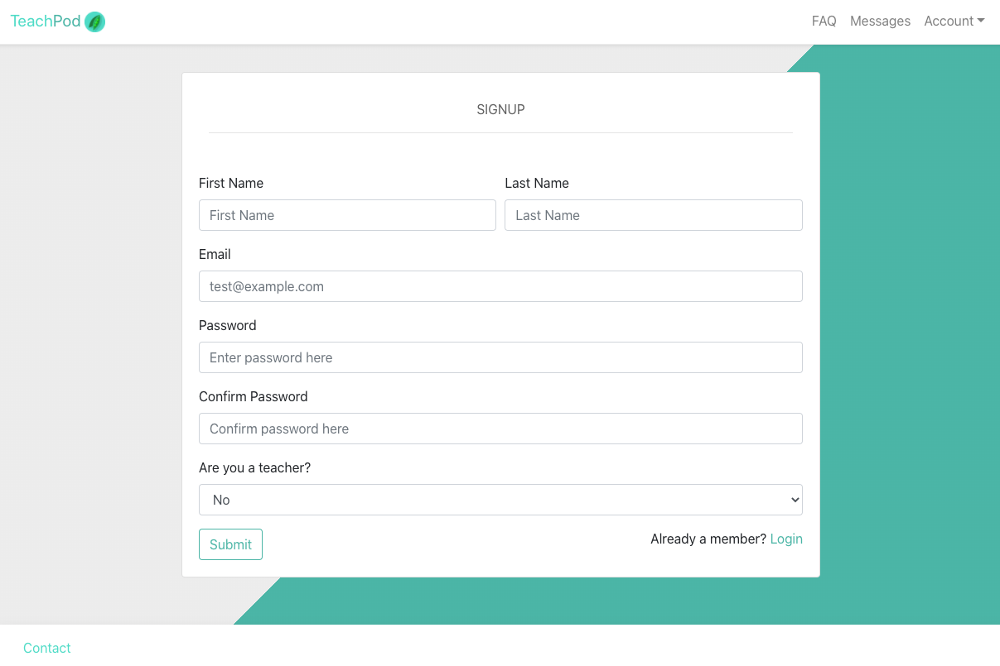
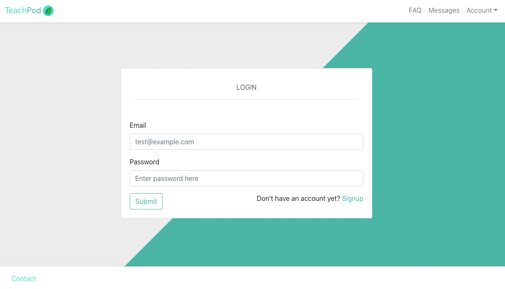
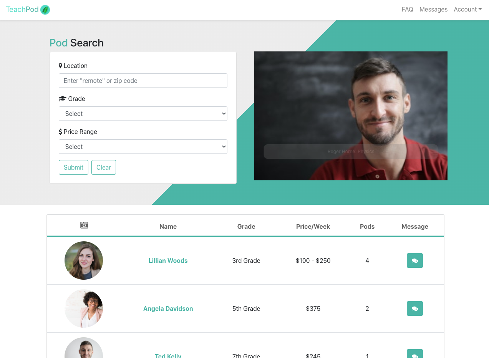
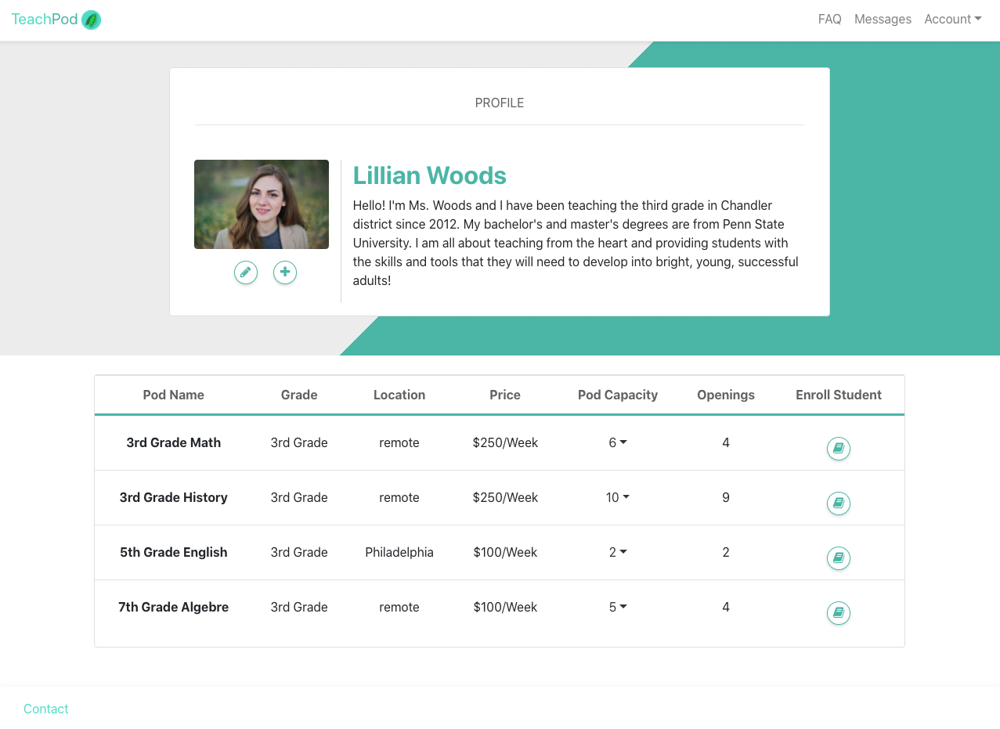
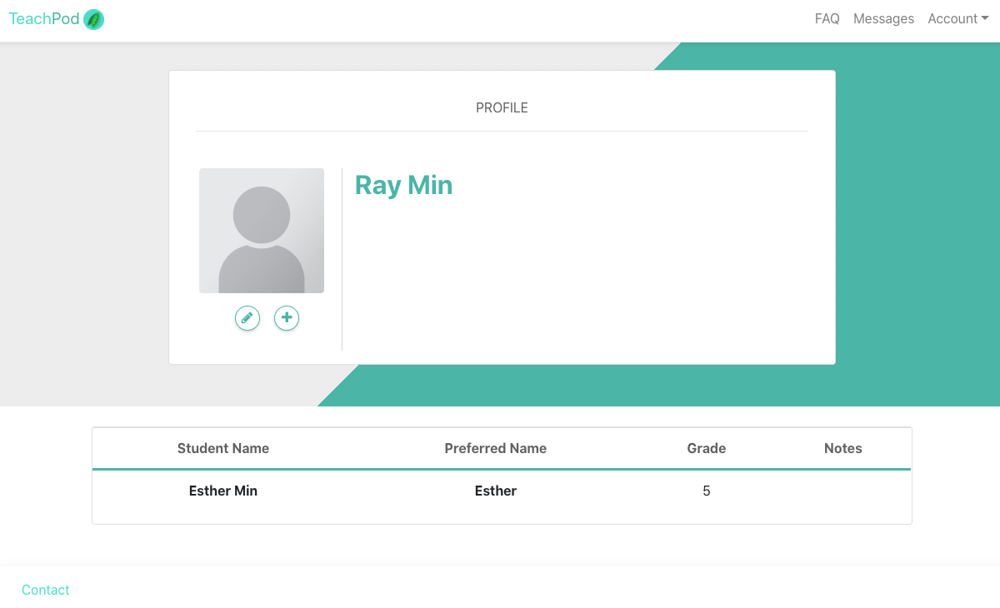
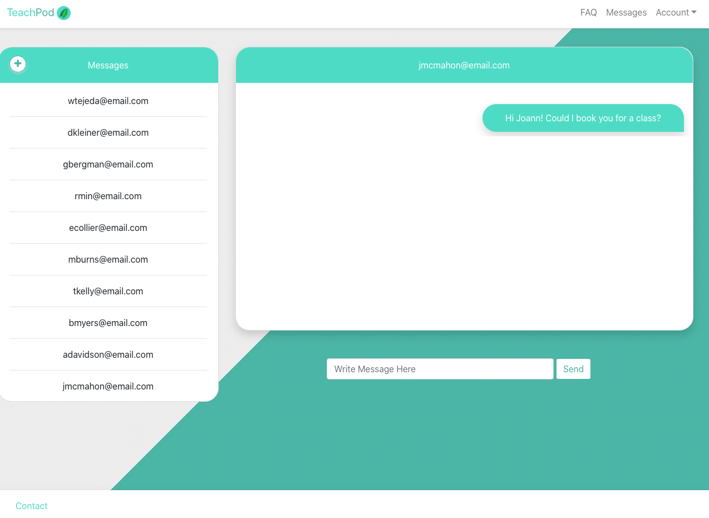
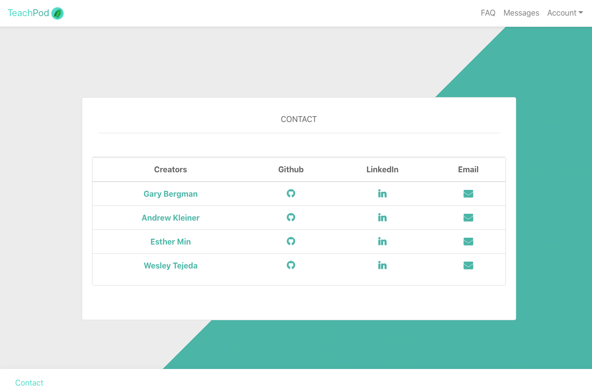
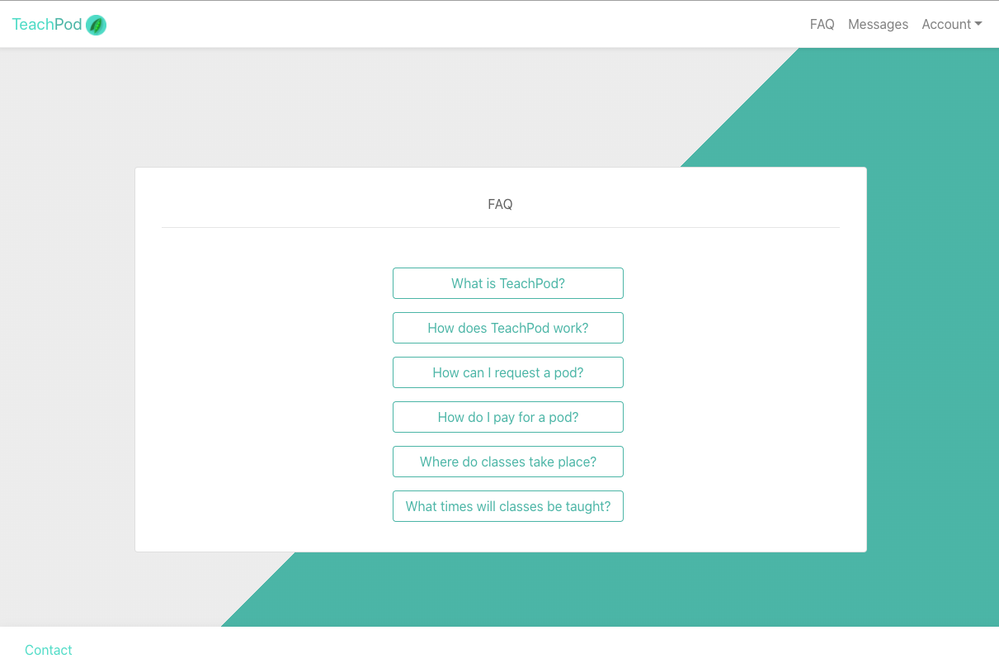

# TeachPod

## Deployed

[Deployed Link](https://teachpod.herokuapp.com/)

## Test

Parent:
* User: gbergman@email.com
* Password: test123

Teacher:
* User: lwoods@email.com
* Password: test1234

## About

As it becomes more and more evident that the world's battle with Covid-19 is not a fleeting historical occurrence, the need to find a new normal is more apparent. One of the biggest pieces to that puzzle is the approach to the school year. If students are unable to safely go back to school, the burden is placed on the working class parents to ensure their education. As seen in the New York Times, "Desperate for a better solution, parents around the country have started organizing “pandemic pods,” or home schooling pods, for the fall, in which groups of three to 10 students learn together in homes under the tutelage of the children’s parents or a hired teacher."

TeachPod offers a quick and easy solution to finding and organizing these pods, to alleviate the stress from both overwhelmed parents, and now jobless teachers. Using React and Reactstrap, TeachPod allows the user to search for teachers and pods that fit the criteria they are looking for. Utilizing Reacts virtual DOM and state functionality, a user can search for pods by location, grade, and price range. Utilizing an original messaging system, the user can then contact a teacher and book a spot in a pod for their child. TeachPod also utilizes an original authenticated login to check if a user is a teacher or parent, and make dynamic changes to the site based upon the user type. Parents can add children to their profile and edit their details, while teachers can add and edit pods under their profile.

With the implementation of TeachPod, the world will be ready to preemptively prepare for the new school year, rather than react to it. It will be safer for parents, children, and teachers. It also will help keep our society functioning at its best potential.

## Index
- [TeachPod](#teachpod)
  - [Deployed](#Deployed)
  - [Test Accounts](#Test)
  - [About](#about)
  - [Index](#index)
  - [User-Story](#user-story)
  - [Instalation:](#instalation)
  - [Usage:](#usage)
  - [Contributors](#contributors)
  - [Screenshots](#screenshots)
    - [Signup](#signup)
    - [Login](#login)
    - [Home](#home)
    - [Teacher Profile](#teacher-profile)
    - [Parent Profile](#parent-profile)
    - [Messages](#messages)
    - [Contact](#contact)
    - [FAQ](#faq)

## User-Story

<ul>AS A PARENT
<li>WHEN I search for a pod based on select criteria</li>
<li>THEN I can view recommendations of teachers who are hosting pods that meet my criteria and if those pods have any open slots</li>
<li>WHEN I click on a specific teacher</li>
<li>THEN I am taken to the teacher’s profile where I can view his/her bio and experience</li>
<li>WHEN I click on “request to join” for a pod
</li>
<li>THEN the messenger pops up where I can message the teacher about the pod’s availability and my child’s enrollment</li>
<li>WHEN I click on the messaging forum</li>
<li>THEN I can read messages from other parents and post my own messages</li>
</ul>

## Instalation:
Enter NPM install in both the root and client folders. All dependencies will automatically install.

## Usage:
Run npm start in both the root and client folder, and visit the local site at http://localhost:3000/, or visit the launched site at 

## Contributors
<a href="https://github.com/Gary-Bergman">Gary Bergman</a>\
<a href="https://github.com/akleiner26">Andrew Kleiner</a>\
<a href="https://github.com/jungjungie">Esther Min</a>\
<a href="https://github.com/WesleyTejeda">Wesley Tejeda</a>

## Screenshots

### Signup

### Login

### Home

### Teacher Profile

### Parent Profile

### Messages

### Contact

### FAQ

